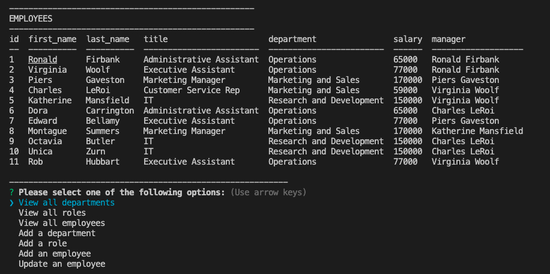

# Employee Tracker README 

  

## Table of Contents 

* [Description](#description)
* [Installation](#installation)
* [Usage](#usage)
* [License](#license)
* [Contributions](#contributions)
* [Test](#tests)
* [Questions](#questions)

## Description 
Employee Tracker v1

Employee Tracker was created for the purpose giving business owners the ability to view and manage the departments, roles, and employees in order to organize and plan their business.

Link: https://github.com/wendyqnguyen/employee-tracker

## Installation 
1) Install mysql https://dev.mysql.com/doc/mysql-installation-excerpt/5.7/en/
2) Install npm: https://www.npmjs.com/. 
3) Install Node JS via nmp: https://nodejs.org/en/download/package-manager/. 
4) Install the following npm packages: mysql2/promise, inquirer, console.table, 

## Usage 

- Enter app command "node server.js".
- Follow the main prompt by selecting one of the following options;
'View all departments', 'View all roles', 'View all employees', 'Add a department', 'Add a role', 'Add an employee', or 'Update an employee role'.
- If 'View all departments' is chosen, user is presented with a formatted table showing department names and department ids.
- If 'View all roles' is chosen, user is presented with the job title, role id, the department that role belongs to, and the salary for that role.
- If 'View all employees' is chosen, user is presented with a formatted table showing employee data, including employee ids, first names, last names, job titles, departments, salaries, and managers that the employees report to.
- If 'Add a department' is chosen, user is prompted to enter the name of the department and that department is added to the database.
- If 'Add a role' is chosen, user is prompted to enter the name, salary, and department for the role and that role is added to the database.
- If 'Add an employee' is chosen, user is prompted to enter the employee’s first name, last name, role, and manager and that employee is added to the database.
- If 'Update an employee role' is chosen, user is prompted to select an employee to update and their new role and this information is updated in the database .

Demo videos: 
Part 1 - https://watch.screencastify.com/v/X7nXQt3Ma75J2xOS3rfG
Part 2 - https://watch.screencastify.com/v/NYmEKIUoJ50SkbzX051G

## License 
    MIT

## Contributions 

Developers: https://github.com/wendyqnguyen/

## Tests 

Tests for this project is under development

## Questions 

For general inquiry regarding Employee Tracker, please contact us via the following channels: 

- wendyqnguyen - [@github](https://github.com/wendyqnguyen/)

